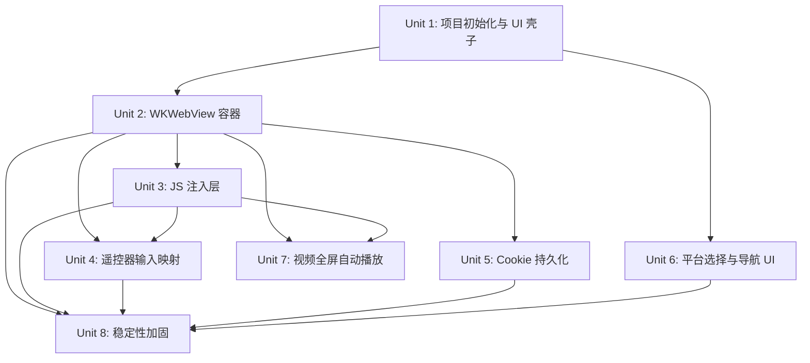

# feat: 构建 tvOS WKWebView 浏览器用于国内视频平台

## 概述

开发一款纯 tvOS 客户端应用，基于 WKWebView 加载优酷、腾讯视频、爱奇艺网页版，通过 JavaScript 注入和 Siri Remote 遥控器映射，实现 Apple TV 上的原生浏览和观看体验。不做后端、不逆向 API、不处理 DRM——复杂度全部由各平台网页播放器承担。

## 问题定位

优酷、腾讯视频、爱奇艺均无 tvOS 客户端，但其网页版播放器已完整支持认证、播放、DRM、选集等功能。用户在国内，持有 VIP 会员，需要一个能用遥控器操作的电视端浏览器，直接复用网页版的完整能力。

## 需求追溯

- R1. 基于 WKWebView 加载三家平台网页版
- R2. 支持各平台网页内会员登录，Cookie 持久化
- R3. 按平台提供入口（首页 Tab 或快捷入口）
- R4. Siri Remote 方向输入映射为页面焦点移动和滚动
- R5. 点击映射为网页元素点击，播放时映射为播放/暂停
- R6. Menu 键优先返回上一页/关闭浮层，无历史时退出
- R7. 自动检测并全屏播放网页视频
- R8. 全屏播放时方向键映射为快进快退和音量控制
- R9. JS 注入放大字体、调整间距，适配电视观看距离
- R10. 隐藏移动端顶部导航、底部 Tab 栏等非内容 UI

## 范围边界

- 不做后端服务 —— 纯 tvOS 客户端
- 不做公开分发（不上架 App Store、不用 TestFlight）
- 不做视频下载或离线缓存
- 不处理直播内容（仅点播）
- 不做弹幕、评论等社交功能
- 不做统一聚合搜索

## 技术上下文

### 技术栈

| 层 | 选型 |
|---|------|
| 语言 | Swift 6 |
| UI 框架 | SwiftUI |
| Web 引擎 | WKWebView（通过 UIViewRepresentable 桥接） |
| JS 注入 | WKUserScript（`atDocumentEnd`） |
| JS ↔ Native 通信 | WKScriptMessageHandler |
| Cookie 持久化 | WKHTTPCookieStore + NSKeyedArchiver |
| 最低系统 | tvOS 17.0 |
| 构建工具 | Xcode 26 |
| 外部依赖 | 无（纯 Apple SDK） |

### 关键架构模式

**WKWebView 在 SwiftUI 中的桥接**：tvOS 没有 SwiftUI 原生的 WebView 组件。必须通过 `UIViewRepresentable` 封装 UIKit 的 `WKWebView`，在 `makeUIView` 中配置 `WKWebViewConfiguration` 和注入 `WKUserScript`，通过 `Coordinator` 实现 `WKScriptMessageHandler` 协议处理 JS 回传消息。

**基于 JS 的虚拟焦点系统**：tvOS 的原生焦点引擎不穿透 WKWebView 边界。标准方案是在 JS 层维护一个虚拟焦点环：注入 CSS `.tv-focused` 样式，Siri Remote 方向输入通过 `evaluateJavaScript` 调用 JS 函数移动焦点索引，Select 键触发 `.click()`。

**Cookie 持久化**：WKWebView 的 `WKHTTPCookieStore` 在 Web Content 进程被系统回收后可能丢失 Cookie。标准做法是在 `sceneDidEnterBackground` 中读出所有 Cookie 并通过 `NSKeyedArchiver` 归档到 `UserDefaults`，App 启动时恢复。同时使用共享的 `WKProcessPool` 确保多个 WKWebView 实例间共享会话。

### 参考文件

- `/Users/ikuai/xxqg/CLAUDE.md` —— 项目概述和架构约束
- `docs/brainstorms/2026-04-24-chinese-streaming-tvos-requirements.md` —— 需求规格

## 关键技术决策

- **JS 虚拟焦点而非原生焦点引擎**：tvOS 原生焦点系统无法穿透 WKWebView。JS 层维护焦点索引是 Apple 官方未提供 Web 内容焦点桥接 API 前提下的唯一可行方案。
- **按平台拆分 JS 补丁脚本**：三家网站 DOM 结构各不相同，每个平台独立一个 JS 文件，按当前加载的 URL 选择性注入。避免一个巨型脚本处理所有平台导致维护混乱和冲突。
- **用 MutationObserver 做视频检测而非轮询**：监听 DOM 变更来检测 `<video>` 元素插入，比 `setInterval` 轮询更省资源且响应更快。
- **Cookie 手动持久化**：tvOS 上 WKWebView 的 Web Content 进程可随时被系统回收，仅依赖 WKHTTPCookieStore 默认行为不够可靠。手动做 save/restore 是保证登录态不丢失的必要措施。
- **tvOS 17.0 最低版本**：需要 SwiftUI 的 `@FocusState`、`.focusable()`、`onMoveCommand` 等 API（tvOS 17 引入），同时覆盖所有在用的 Apple TV HD 和 4K 型号。

## 待定问题

### 规划阶段已解决

- tvOS WKWebView 的 focus/blur 和键盘事件支持程度 → **解决**：采用 JS 虚拟焦点方案，不依赖原生 focus API
- Siri Remote 按键事件如何映射到网页交互 → **解决**：SwiftUI `onMoveCommand` 捕获方向，`evaluateJavaScript` 传入 JS 层
- 网页视频自动全屏触发机制 → **解决**：MutationObserver 监听 video 元素 + WKScriptMessageHandler 通知原生层
- Cookie 持久化策略 → **解决**：NSKeyedArchiver 手动 bridge
- 最低 tvOS 版本 → **解决**：tvOS 17.0

### 推迟到实现阶段

- 三家平台具体 CSS 选择器清单 —— 需要实际加载网页后通过 Safari Web Inspector 分析 DOM
- 各平台画质对应的流参数 —— 由网页播放器自身处理，不需逆向
- JS 注入后网页交互的具体细节调整 —— 依赖实际测试迭代

## 实现单元

- [ ] **Unit 1: 项目初始化与 SwiftUI 壳子**

**目标：** 创建 Xcode 项目，建立 App 入口和基础 Tab 导航结构

**需求：** R3

**依赖：** 无

**文件：**
- 创建：`xxqg.xcodeproj`（Xcode 项目文件）
- 创建：`xxqg/xxqgApp.swift`（App 入口，`@main`）
- 创建：`xxqg/ContentView.swift`（根视图：TabView 或平台选择网格）
- 创建：`xxqg/Views/PlatformListView.swift`（三个平台的入口按钮/卡片）
- 创建：`xxqg/Views/BrowserView.swift`（占位：后续 Unit 2 替换为 WebView）

**方案：**
- 用 SwiftUI `TabView` 或自定义网格视图展示三个平台入口
- 每个平台用 Logo 或文字标识（优酷 / 腾讯视频 / 爱奇艺）
- 点击进入对应平台的 WebView 容器视图
- tvOS 17+ 项目配置，Swift 6，SwiftUI lifecycle
- 在 Xcode 中配置 Bundle Identifier、部署目标 tvOS 17.0

**可参考的模式：**
- tvOS SwiftUI `TabView` 官方模板
- `.focusable()` 修饰符确保遥控器可选中文档

**测试场景：**
- App 启动后显示三个平台入口
- 用遥控器方向键可以在入口间移动焦点
- 选择某个平台后导航到对应的 WebView 视图（占位视图即可）

**验证：**
- Xcode 项目能编译并在 Apple TV 模拟器中运行
- 三个平台入口可见且可通过遥控器切换焦点

---

- [ ] **Unit 2: WKWebView 容器封装**

**目标：** 实现 SwiftUI 可用的 WKWebView 封装组件，支持加载 URL 和 JavaScript 注入

**需求：** R1, R2（Cookie 基础支持）

**依赖：** Unit 1

**文件：**
- 创建：`xxqg/WebContainer/TVWebView.swift`（UIViewRepresentable 封装）
- 创建：`xxqg/WebContainer/WebViewCoordinator.swift`（Coordinator + WKScriptMessageHandler）
- 创建：`xxqg/WebContainer/JSInjector.swift`（WKUserScript 管理）
- 修改：`xxqg/Views/BrowserView.swift`（替换占位为 TVWebView）

**方案：**
- `TVWebView`：`UIViewRepresentable`，接受 `url: URL` 和 `scripts: [WKUserScript]` 参数
- `makeUIView` 中创建 `WKWebView`，配置：
  - `allowsInlineMediaPlayback = true`
  - `mediaTypesRequiringUserActionForPlayback = []`（允许自动播放）
  - `allowsLinkPreview = false`
- `JSInjector`：管理所有 WKUserScript 的注册和按需注入
- 使用共享 `WKProcessPool` 单例确保跨 WebView 的 Cookie 共享
- Coordinator 实现 `WKNavigationDelegate` 和 `WKScriptMessageHandler`

**可参考的模式：**
- 标准 SwiftUI `UIViewRepresentable` 桥接模式
- Apple WebKit 文档中 `WKWebViewConfiguration` 的 tvOS 可用字段

**测试场景：**
- 创建 TVWebView 加载一个测试 URL，确认页面能正常渲染
- 注入一个简单的 WKUserScript，确认脚本在页面加载后被执行
- `makeCoordinator` 返回的 Coordinator 能收到 WKScriptMessageHandler 回调

**验证：**
- TVWebView 能加载 youku.com / v.qq.com / iqiyi.com 首页并渲染
- JS 注入管道打通：注入的测试脚本能被 WKWebView 执行

---

- [ ] **Unit 3: JavaScript 注入层 —— 焦点导航与视觉适配**

**目标：** 编写核心 JS 注入脚本，实现页面元素焦点管理和 TV 端视觉适配

**需求：** R4, R5, R9, R10

**依赖：** Unit 2

**文件：**
- 创建：`xxqg/WebContainer/Scripts/focus-navigation.js`（虚拟焦点导航）
- 创建：`xxqg/WebContainer/Scripts/visual-adaptation.js`（字体放大、间距调整、隐藏移动端 UI）
- 创建：`xxqg/WebContainer/Scripts/video-autofullscreen.js`（视频全屏检测）
- 创建：`xxqg/WebContainer/Scripts/platform-patches/youku.js`
- 创建：`xxqg/WebContainer/Scripts/platform-patches/tencent.js`
- 创建：`xxqg/WebContainer/Scripts/platform-patches/iqiyi.js`
- 修改：`xxqg/WebContainer/JSInjector.swift`（加载 .js 文件为 WKUserScript）

**方案：**
- **focus-navigation.js**：
  - 维护 `currentFocusIndex` 和可聚焦元素列表（`a[href]`, `button`, `[role="button"]`, `.video-item` 等）
  - 响应方向移动：计算当前焦点元素与候选元素的几何距离（中心点），取最小距离为下一个焦点
  - 应用/移除 `.tv-focused` CSS 类（`outline: 3px solid #fff; transform: scale(1.05); transition: all 0.15s`）
  - Select 键调用 `element.click()` 或 `element.dispatchEvent(new MouseEvent('click'))`
- **visual-adaptation.js**：
  - 注入全局 CSS 样式：`body { font-size: 180% !important; }`，增大列表项行距
  - 隐藏常见移动端导航：`.app-header`, `.mobile-nav`, `.bottom-tab-bar`, `.m-top-nav` 等通用选择器
  - 调整视频播放器容器 `position: fixed; top: 0; left: 0; width: 100vw; height: 100vh`
- **平台补丁脚本**：每个平台独立文件，针对该网站特有的 DOM 选择器做隐藏/调整
- 所有脚本使用 IIFE 包裹避免全局变量污染

**可参考的模式：**
- 空间最近邻算法用于焦点移动（spatial navigation）
- Web 无障碍焦点管理实践（`:focus-visible` 等）

**测试场景：**
- 加载任意包含链接和按钮的简单测试页面，确认能用遥控器方向键移动焦点
- 焦点移动后 `.tv-focused` 类正确应用和移除
- Select 键能触发被聚焦元素的 click 事件
- 字体放大注入后页面文字明显变大
- 移动端导航元素注入后被隐藏

**验证：**
- 在 Apple TV 模拟器中打开三家平台任一网站的首页，能看到焦点框在元素间移动
- 页面字体适配电视观看距离（3-5 米）
- 移动端导航栏被隐藏，只保留内容区域

---

- [ ] **Unit 4: 遥控器输入映射**

**目标：** 将 Siri Remote 的物理输入事件通过 SwiftUI 和 JS bridge 传递到网页

**需求：** R4, R5, R6, R8

**依赖：** Unit 2, Unit 3

**文件：**
- 创建：`xxqg/Input/RemoteInputHandler.swift`（SwiftUI 手势/按键处理）
- 修改：`xxqg/WebContainer/TVWebView.swift`（集成 RemoteInputHandler）
- 修改：`xxqg/WebContainer/Scripts/focus-navigation.js`（对接方向输入）

**方案：**
- `onMoveCommand` 捕获遥控器上下左右方向：
  - 非播放状态 → `evaluateJavaScript("tvOSFocus.move('up/down/left/right')")`
  - 全屏播放状态 → 左/右映射为快进快退 (+/-10s)，上/下映射为音量调节
- `.onTapGesture` 或 Play/Pause 键 → `evaluateJavaScript("tvOSFocus.select()")`
- Menu 键 → 优先执行 `evaluateJavaScript("history.back()")`，若无历史则 `dismiss` 返回上级视图
- 考虑在 WKWebView 上叠加一层 SwiftUI `focusable` 视图来捕获 Siri Remote 事件，事件处理后转发到 JS

**可参考的模式：**
- SwiftUI `onMoveCommand` API（tvOS 专用）
- `UIPress` / `UIGestureRecognizer` 底层事件捕获（如果需要更细粒度控制）

**测试场景：**
- 在网页上按遥控器方向键，焦点框按方向移动
- 在有浮层/弹窗的页面上按 Menu 键，弹窗关闭而非退出 WebView
- 无更多历史页面时按 Menu 键，返回平台选择页面
- 视频全屏播放时按左/右方向键，进度快退/快进
- 播放中按 Select 键，视频暂停/恢复

**验证：**
- 用遥控器完成一次完整的浏览→选择视频→播放→暂停→返回操作流程，无卡顿或异常

---

- [ ] **Unit 5: Cookie 持久化**

**目标：** 实现跨 App 重启的登录态保持

**需求：** R2

**依赖：** Unit 2

**文件：**
- 创建：`xxqg/WebContainer/CookieManager.swift`
- 修改：`xxqg/xxqgApp.swift`（场景生命周期中调用 save/restore）
- 修改：`xxqg/WebContainer/TVWebView.swift`（使用共享 WKProcessPool）

**方案：**
- 共享 `WKProcessPool` 单例 → 不同 WKWebView 实例共享内存中的 Cookie
- `sceneDidEnterBackground` 时：
  - 通过 `WKWebsiteDataStore.default().httpCookieStore.getAllCookies` 读取全部 Cookie
  - `NSKeyedArchiver.archivedData` 序列化 → `UserDefaults.standard.set(data, forKey:)`
- App 启动时：
  - `UserDefaults` 读取反序列化 → `setCookie` 逐个恢复到 `httpCookieStore`
- 清理策略：仅对过期 Cookie 做清理，不主动清除有效的登录态

**可参考的模式：**
- Apple WKHTTPCookieStore 官方文档
- `HTTPCookie` 的 `NSSecureCoding` 协议支持

**测试场景：**
- 登录一个平台账号 → 杀掉 App → 重新打开 → 进入该平台网页，确认仍为登录状态
- WKWebView 的 Web Content 进程被系统回收后，重新加载页面，Cookie 仍然存在

**验证：**
- 在至少一个平台上登录后，完全退出 App（滑动退出），重新打开，无需重新登录
- 当天内多次使用，登录状态持续保持

---

- [ ] **Unit 6: 平台选择与导航 UI**

**目标：** 完善三个平台的入口界面和 WebView 内页面导航

**需求：** R3, R6

**依赖：** Unit 1, Unit 2

**文件：**
- 修改：`xxqg/Views/PlatformListView.swift`（入口 UI 细化）
- 创建：`xxqg/Views/PlatformIcon.swift`（平台图标/Logo 组件）
- 修改：`xxqg/Views/BrowserView.swift`（导航栏、平台标题、加载状态）
- 创建：`xxqg/Navigation/NavigationState.swift`（页面历史栈管理）

**方案：**
- 入口页面采用大卡片网格布局，每个平台一张大卡片，用品牌色区分（优酷蓝、腾讯绿、爱奇艺绿）
- WebView 视图顶部显示当前平台名称和加载进度条
- 维护每个 WebView 的历史栈，Menu 键行为：有历史 → `goBack()`，无历史 → 返回平台选择页
- 页面加载过程中显示 `ProgressView`，加载完成后隐藏

**可参考的模式：**
- Apple TV 原生 App 的导航模式（如 Apple TV App 的 Top Shelf 布局）
- tvOS `NavigationStack` 或自定义导航状态管理

**测试场景：**
- 三个平台入口显示品牌名称和识别色，焦点切换流畅
- 选中平台后推入 WebView，页面加载过程中显示进度指示
- 页面加载完成后进度指示消失，显示网页内容
- 在某个平台内浏览了多个页面后，按 Menu 键逐级返回，最后回到平台选择页

**验证：**
- UI 在 3-5 米观看距离下清晰可辨
- 导航流程符合遥控器操作直觉：选平台→加载网页→浏览→返回

---

- [ ] **Unit 7: 视频全屏自动播放**

**目标：** 检测网页中的视频播放并自动进入全屏模式

**需求：** R7, R8

**依赖：** Unit 2, Unit 3

**文件：**
- 修改：`xxqg/WebContainer/Scripts/video-autofullscreen.js`（完善自动全屏逻辑）
- 修改：`xxqg/WebContainer/WebViewCoordinator.swift`（处理全屏请求消息）
- 修改：`xxqg/WebContainer/TVWebView.swift`（原生播放器集成）

**方案：**
- `MutationObserver` 监听 DOM 中 `<video>` 元素的插入和 `play` 事件
- 视频开始播放时通过 `webkit.messageHandlers.tvOSBridge.postMessage({type: 'videoPlaying'})` 通知原生层
- 原生层收到消息后触发视频全屏（利用 `AVPlayerViewController` 或 WKWebView 内建全屏）
- 视频播放/暂停事件同步到遥控器操作映射
- 全屏状态下隐藏注入的焦点环 CSS，避免影响视频观看

**可参考的模式：**
- WebKit `fullscreenchange` 事件和 `webkitEnterFullscreen()` 方法
- MutationObserver API 标准用法

**测试场景：**
- 在任一平台上点播一个视频，视频开始播放后自动进入全屏
- 全屏状态下方向左/右触发快进快退
- 视频播放完毕或按 Menu 键退出全屏，回到网页浏览状态
- 网站自身有全屏按钮时，点击也能正常全屏

**验证：**
- 从选择视频到全屏播放的整个过程自动化，用户只需一次点击

---

- [ ] **Unit 8: 边缘情况与稳定性加固**

**目标：** 处理 WebView 崩溃恢复、网络异常、加载失败等边缘情况

**需求：** R1（可靠性）

**依赖：** Unit 2-7

**文件：**
- 修改：`xxqg/WebContainer/WebViewCoordinator.swift`（实现 WKWebView 进程终止回调）
- 修改：`xxqg/Views/BrowserView.swift`（错误状态 UI、重试按钮）
- 创建：`xxqg/WebContainer/NetworkMonitor.swift`（局域网连通性检测）
- 修改：`xxqg/WebContainer/TVWebView.swift`（加载失败处理）

**方案：**
- `webViewWebContentProcessDidTerminate` → 重新加载当前 URL 并恢复 Cookie
- 网络不可用或加载超时时显示 tvOS 风格的错误提示和重试按钮（使用 Siri Remote 可选中的按钮）
- 页面白屏超过 5 秒触发自动刷新
- URL Scheme 处理：对非 http/https 链接不做处理或提示不支持
- 键盘弹出时的处理（网页内有 input 时）

**可参考的模式：**
- WKWebView `webViewWebContentProcessDidTerminate` 官方文档
- Apple HIG tvOS 错误状态设计指南

**测试场景：**
- 加载一个不存在的 URL，确认显示错误提示和重试按钮
- 模拟网络断开后加载页面，确认显示网络错误提示
- 快速切换三个平台多次，确认 WKWebView 不出现内存暴涨或崩溃
- 在网页内点击非 http 链接（如 `youku://` scheme），确认不崩溃并给出提示

**验证：**
- App 在正常使用场景下不出现崩溃或白屏无法恢复的情况
- 可恢复的错误（网络抖动、进程回收）能自动或手动恢复

## 系统级影响

- **交互面：** 主要交互路径：Siri Remote → SwiftUI `onMoveCommand` → `evaluateJavaScript` → JS 焦点引擎 → DOM 元素交互。回传：`WKScriptMessageHandler` → SwiftUI 原生处理（全屏、导航）
- **错误传递：** JS 层异常通过 `console.error` 输出，不影响原生层；WKWebView 进程终止通过 `webViewWebContentProcessDidTerminate` 在原生层兜底
- **状态一致性：** Cookie 存储在 WKHTTPCookieStore + UserDefaults 双份，历史栈在 SwiftUI 内存中，页面状态完全在 WKWebView 内
- **不变约束：** App 不向任何外部服务发送请求，所有网络请求由 WKWebView 直连目标网站 CDN；不自行管理任何用户凭证

## 依赖图



## 风险与缓解

| 风险 | 缓解措施 |
|------|---------|
| 平台网页结构变更导致 JS 注入失效 | 平台补丁脚本独立分文件，更新网站对应文件即可；视觉适配脚本用通用选择器兜底 |
| 平台可能对 WKWebView UA 做限制 | 设置自定义 User-Agent 模拟 Safari Desktop/Mobile |
| Apple TV 内存有限，WKWebView 可能被系统回收 | 实现 `webViewWebContentProcessDidTerminate` 自动恢复；Cookie 持久化保证登录态不丢 |
| Siri Remote 方向事件在 WKWebView 上可能被 Web 内容拦截 | 在 SwiftUI 层用 `.focusable` + `onMoveCommand` 捕获事件，不依赖 Web 端接收原生焦点事件 |
| tvOS 模拟器与真机 WKWebView 行为差异 | 尽早用真机测试关键路径（视频播放、Cookie 持久化） |

## 文件清单

```
xxqg/
├── xxqgApp.swift                  # @main App 入口
├── ContentView.swift              # 根视图
├── Views/
│   ├── PlatformListView.swift     # 三个平台入口选择
│   ├── PlatformIcon.swift         # 平台图标组件
│   └── BrowserView.swift          # WebView 容器视图
├── WebContainer/
│   ├── TVWebView.swift            # UIViewRepresentable 封装 WKWebView
│   ├── WebViewCoordinator.swift   # Coordinator + WKNavigationDelegate + WKScriptMessageHandler
│   ├── JSInjector.swift           # WKUserScript 的加载和注入管理
│   ├── CookieManager.swift        # Cookie 的持久化和恢复
│   ├── NetworkMonitor.swift       # 网络连通性检测
│   └── Scripts/
│       ├── focus-navigation.js    # 虚拟焦点导航
│       ├── visual-adaptation.js   # 字体/间距/UI 隐藏
│       ├── video-autofullscreen.js # 视频全屏自动检测
│       └── platform-patches/
│           ├── youku.js           # 优酷专用补丁
│           ├── tencent.js         # 腾讯视频专用补丁
│           └── iqiyi.js           # 爱奇艺专用补丁
├── Input/
│   └── RemoteInputHandler.swift   # Siri Remote 事件处理
├── Navigation/
│   └── NavigationState.swift      # 页面历史栈管理
└── Assets.xcassets/               # App 图标、平台 Logo 等资源
```

## 来源与参考

- **需求文档：** [docs/brainstorms/2026-04-24-chinese-streaming-tvos-requirements.md](../brainstorms/2026-04-24-chinese-streaming-tvos-requirements.md)
- **项目指引：** [CLAUDE.md](../../CLAUDE.md)
- 相关技术参考：Apple WebKit 文档（WKWebView, WKUserScript, WKScriptMessageHandler）、SwiftUI tvOS API（onMoveCommand, focusable, UIViewRepresentable）
- 目标网站：youku.com / v.qq.com / iqiyi.com
