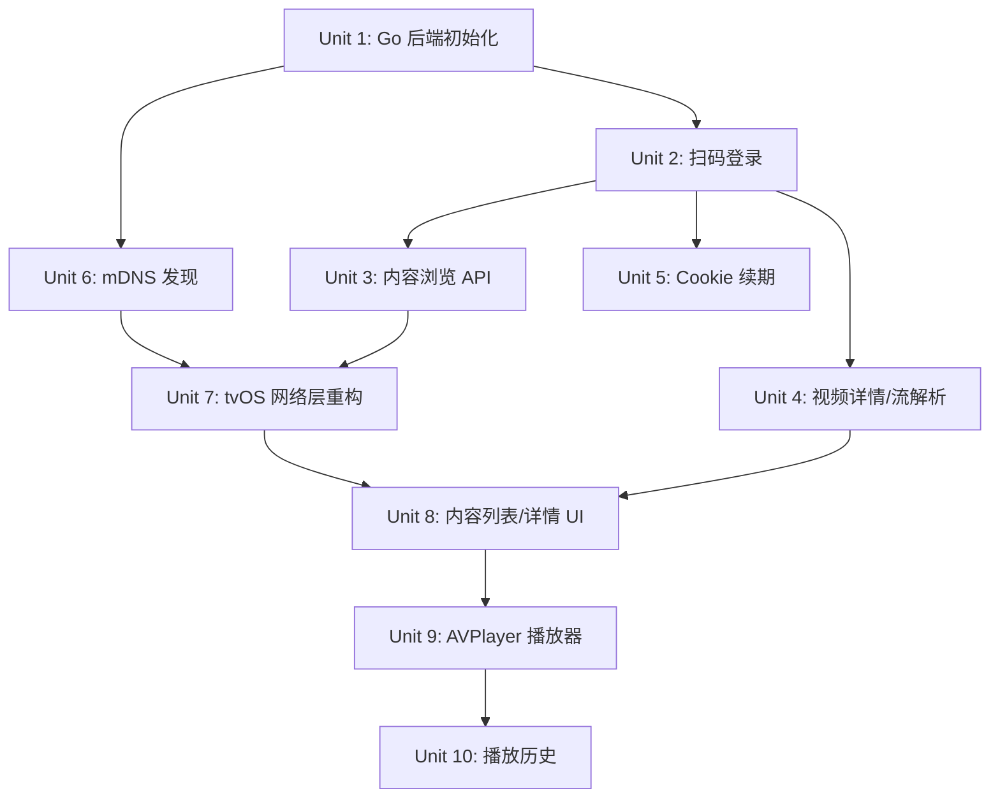

# feat: 后端聚合 + tvOS AVPlayer 播放器

## 概述
tvOS 18 / Xcode 26 已移除 WebKit，浏览器方案不可行。改为搭建本地 Go 后端服务，逆向对接优酷/腾讯/爱奇艺的非公开 API 获取视频流地址，tvOS 端用原生 AVPlayer 播放。

## 问题定位
需要在 Apple TV 上观看国内视频平台内容。tvOS 没有浏览器支持，唯一可行路径是后端聚合视频流 + 原生播放器。

## 需求追溯

- R1. 支持三家平台内容聚合
- R2. 扫码登录
- R3. 内容浏览 API（推荐/分类/搜索）
- R4. 视频详情 API（剧集/选集）
- R5. 视频流解析 API（m3u8 多清晰度）
- R6. Cookie 自动续期
- R7. 本地 NAS 部署
- R8. tvOS 平台选择首页
- R9. tvOS 内容列表页
- R10. tvOS 视频详情页
- R11. tvOS AVPlayer 播放器
- R12. tvOS 登录态管理（二维码）
- R13. tvOS 播放历史
- R14-R16. 部署相关

## 范围边界

- 不做公开分发
- 不做下载/离线缓存
- 不处理直播
- 不做弹幕/评论
- 不做智能推荐（用平台原数据）
- 不做多用户

## 关键技术决策

- **后端：Go + Gin**：二进制部署简单，适合 NAS（see origin）
- **认证：扫码登录**：TV 端最自然的体验（see origin）
- **通信：REST API + JSON**：tvOS URLSession 原生支持（see origin）
- **视频流：直接透传**：后端只给 m3u8 URL，tvOS 直接请求 CDN（see origin）
- **服务发现：mDNS/Bonjour**：tvOS 自动发现局域网后端，无需手动输入 IP
- **数据存储：纯内存 + 配置文件**：不引入数据库，Cookie 和播放历史存 JSON 文件

## 架构

```
┌─────────────────┐     REST/JSON      ┌──────────────────┐     HTTP/逆向    ┌──────────┐
│   Apple TV      │ ◄────────────────► │   Go Backend     │ ◄────────────► │ 优酷/腾讯/│
│  SwiftUI App    │    mDNS 发现       │   (Gin)          │   扫码登录      │ 爱奇艺   │
│  AVPlayer       │                    │   192.168.x.x    │   视频流解析    │          │
└─────────────────┘                    └──────────────────┘                └──────────┘
```

## 待定问题

### 规划阶段已解决

- 服务发现机制 → **mDNS/Bonjour**
- 数据存储 → **JSON 文件（无数据库）**
- API 鉴权 → **局域网内不鉴权**（仅个人使用，NAS 在内网）

### 推迟到实现阶段

- [影响 R2][需要调研] 各平台扫码登录接口流程（需要抓包分析）
- [影响 R3-R5][需要调研] 各平台内容列表/详情/视频流接口逆向
- [影响 R5][需要调研] m3u8 是否带 DRM，AVPlayer 兼容性
- [影响 R6][需要调研] Cookie 续期策略（各平台不同）
- [影响 R11][需要调研] AVPlayer HLS 多清晰度切换

## 实现单元

- [ ] **Unit 1: Go 后端项目初始化**

**目标：** 建立 Go + Gin 项目结构，配置管理，health check 接口

**需求：** R7, R14-R16

**依赖：** 无

**文件：**
- 创建：`backend/go.mod`
- 创建：`backend/main.go`（入口，Gin 路由注册）
- 创建：`backend/config/config.go`（配置文件解析）
- 创建：`backend/api/health.go`（health check）
- 创建：`backend/config.yaml`（示例配置）

**方案：**
- `go mod init tvbrowser-backend`
- 用 `github.com/gin-gonic/gin` 做 HTTP 框架
- 用 `github.com/spf13/viper` 做配置管理（支持 yaml/json/env）
- health check: `GET /health` → `{"status": "ok"}`
- 配置项：端口、平台 Cookie 存储路径、日志级别

**测试场景：**
- Happy path: `go run main.go` 启动后 `curl /health` 返回 200
- Edge case: 配置文件缺失时，使用默认端口 8080
- Error path: 端口被占用时，服务退出并打印错误

**验证：**
- `go build` 成功生成单一二进制
- 运行后 `curl http://localhost:8080/health` 返回 ok

---

- [ ] **Unit 2: 扫码登录模块**

**目标：** 实现三家平台的扫码登录流程：生成二维码 → 轮询状态 → 保存 Cookie

**需求：** R2, R6

**依赖：** Unit 1

**文件：**
- 创建：`backend/platform/platform.go`（平台抽象接口）
- 创建：`backend/platform/youku/auth.go`
- 创建：`backend/platform/tencent/auth.go`
- 创建：`backend/platform/iqiyi/auth.go`
- 创建：`backend/api/auth.go`（HTTP 路由：生成二维码、查询状态）

**方案：**
- 定义 `Platform` 接口：`GenerateQRCode() (qrURL string, token string, err error)`、`CheckLoginStatus(token string) (cookie string, err error)`
- 每个平台独立实现扫码逻辑（接口 URL 和参数需要抓包分析）
- 后端启动一个 goroutine 定时轮询未完成的扫码状态
- 登录成功后 Cookie 保存到 `~/.tvbrowser/cookies/<platform>.json`
- 提供 API：
  - `POST /auth/:platform/qr` → 返回二维码图片 URL 和轮询 token
  - `GET /auth/:platform/status?token=xxx` → 返回 pending/success/fail + cookie

**测试场景：**
- Happy path: 请求二维码 → 模拟扫码成功 → 状态查询返回 cookie
- Error path: 超时未扫码 → 状态返回 expired
- Integration: 扫码成功后，cookie 文件正确写入磁盘

**验证：**
- 能用 Postman 走完一个平台的完整扫码登录流程

---

- [ ] **Unit 3: 内容浏览 API**

**目标：** 提供首页推荐、分类、搜索接口

**需求：** R3

**依赖：** Unit 2

**文件：**
- 创建：`backend/platform/youku/content.go`
- 创建：`backend/platform/tencent/content.go`
- 创建：`backend/platform/iqiyi/content.go`
- 创建：`backend/api/content.go`
- 创建：`backend/model/video.go`（共享数据模型）

**方案：**
- `Video` 模型：`ID`, `Title`, `CoverURL`, `Description`, `Platform`, `Category`, `Duration`
- 每个平台实现 `GetHomepage()`、`GetCategory(catID string)`、`Search(keyword string)` 方法
- API 设计：
  - `GET /api/:platform/home` → `[]Video`
  - `GET /api/:platform/category?id=xxx` → `[]Video`
  - `GET /api/:platform/search?q=xxx` → `[]Video`
- 请求平台接口时带上已保存的 Cookie，获取会员内容
- 结果做简单缓存（内存 map，TTL 5 分钟），减少频繁请求

**测试场景：**
- Happy path: 已登录状态下请求首页，返回视频列表
- Error path: Cookie 失效时，返回 401 并提示重新登录
- Edge case: 平台接口返回空列表，正确处理

**验证：**
- Postman 请求三个平台的首页/分类/搜索，均返回结构化 JSON

---

- [ ] **Unit 4: 视频详情与流解析 API**

**目标：** 视频详情（剧集列表）+ m3u8 流地址解析

**需求：** R4, R5

**依赖：** Unit 3

**文件：**
- 创建：`backend/model/episode.go`
- 创建：`backend/platform/youku/video.go`
- 创建：`backend/platform/tencent/video.go`
- 创建：`backend/platform/iqiyi/video.go`
- 创建：`backend/api/video.go`

**方案：**
- `Episode` 模型：`ID`, `Title`, `Index`, `VideoID`, `Duration`
- `StreamURL` 模型：`Quality`（1080p/720p/480p）, `URL`（m3u8）
- API 设计：
  - `GET /api/:platform/video/:id` → 视频详情 + `[]Episode`
  - `GET /api/:platform/video/:id/stream?episode=xxx` → `[]StreamURL`（多清晰度）
- 视频流解析：逆向平台的播放页接口，提取 m3u8 master playlist 地址
- 返回的 m3u8 URL 直接透传给 tvOS，不做代理

**测试场景：**
- Happy path: 请求视频详情，返回正确的剧集列表
- Happy path: 请求视频流，返回多清晰度 m3u8 地址
- Error path: VIP 专属内容在未登录时返回 403
- Edge case: 单集电影（无剧集列表）正确处理

**验证：**
- m3u8 地址可用 `ffplay` 或 Safari 直接播放验证

---

- [ ] **Unit 5: Cookie 自动续期**

**目标：** 登录态过期前自动刷新，避免频繁重新登录

**需求：** R6

**依赖：** Unit 2

**文件：**
- 创建：`backend/platform/youku/refresh.go`
- 创建：`backend/platform/tencent/refresh.go`
- 创建：`backend/platform/iqiyi/refresh.go`
- 修改：`backend/main.go`（启动定时任务）

**方案：**
- 每个 Cookie 保存时记录 `expires_at`
- 启动一个后台 goroutine，每 30 分钟检查一次
- 对即将过期（剩余 < 2 小时）的 Cookie，调用平台的刷新接口（或重新走一次自动登录流程）
- 刷新成功更新 Cookie 文件，失败则标记为 expired
- 提供一个 API `GET /auth/status` 返回三个平台的登录状态

**测试场景：**
- Happy path: Cookie 即将过期时自动刷新成功
- Error path: 刷新失败时，状态 API 标记为 expired
- Integration: 刷新后新 Cookie 能正常获取会员内容

**验证：**
- 修改 Cookie 的过期时间为即将过期，观察自动刷新是否触发

---

- [ ] **Unit 6: mDNS 服务发现**

**目标：** tvOS 端自动发现局域网内的后端服务

**需求：** R7

**依赖：** Unit 1

**文件：**
- 创建：`backend/discovery/mdns.go`
- 修改：`backend/main.go`

**方案：**
- 后端启动时注册 mDNS 服务：`_tvbrowser._tcp`，端口从配置读取
- 使用 `github.com/grandcat/zeroconf` 库
- tvOS 端用 `NetServiceBrowser` 或 `DNS-SD` 搜索 `_tvbrowser._tcp`
- 发现服务后自动获取 IP 和端口

**测试场景：**
- Happy path: 后端启动后，同一局域网内可被 Bonjour 浏览器发现
- Edge case: 多网卡环境下，绑定到正确的局域网 IP

**验证：**
- 用 `dns-sd -B _tvbrowser._tcp` 或 iOS 的 `Bonjour Browser` App 能发现服务

---

- [ ] **Unit 7: tvOS 客户端重构（网络层 + 服务发现）**

**目标：** 基于之前的 tvOS 项目，重构为请求后端 API 的架构

**需求：** R8, R12

**依赖：** Unit 6

**文件：**
- 创建：`tvBrowser/Services/BackendService.swift`（URLSession 封装）
- 创建：`tvBrowser/Services/DiscoveryService.swift`（mDNS 发现）
- 创建：`tvBrowser/Models/Video.swift`
- 创建：`tvBrowser/Models/Episode.swift`
- 创建：`tvBrowser/Models/StreamURL.swift`
- 修改：`tvBrowser/Views/PlatformListView.swift`（去掉 WebView 相关，加登录状态）
- 创建：`tvBrowser/Views/QRCodeView.swift`（二维码展示）

**方案：**
- `BackendService`：封装 `URLSession` 请求后端 API，自动处理 JSON decode
- `DiscoveryService`：使用 `NetService` 搜索 `_tvbrowser._tcp`，找到后保存 baseURL
- 模型：`Video`、`Episode`、`StreamURL`（Codable）
- 平台选择页：显示三个平台卡片 + 登录状态指示（未登录/已登录）
- 未登录时点击进入二维码页面，调用后端 `POST /auth/:platform/qr`
- 二维码用 `CoreImage` 生成（后端返回的是 URL，tvOS 生成 QRCode 图片）

**测试场景：**
- Happy path: App 启动后自动发现后端服务
- Happy path: 点击未登录平台，显示二维码
- Error path: 局域网内无后端服务时，显示提示

**验证：**
- 真机/模拟器上能看到后端自动被发现
- 二维码页面能正确显示

---

- [ ] **Unit 8: tvOS 内容列表与详情 UI**

**目标：** 网格布局展示视频列表，视频详情页展示剧集

**需求：** R9, R10

**依赖：** Unit 7

**文件：**
- 创建：`tvBrowser/Views/VideoGridView.swift`
- 创建：`tvBrowser/Views/VideoCard.swift`
- 创建：`tvBrowser/Views/VideoDetailView.swift`
- 创建：`tvBrowser/Views/EpisodeListView.swift`
- 修改：`tvBrowser/ContentView.swift`（导航结构）

**方案：**
- `VideoGridView`：`LazyVGrid`，3 列，封面 + 标题，遥控器焦点切换
- `VideoCard`：封面图（`AsyncImage`）+ 标题文字，焦点时放大 1.05x
- `VideoDetailView`：左侧封面大图，右侧标题/简介，底部剧集列表
- `EpisodeListView`：横向滚动的剧集卡片，`ScrollView(.horizontal)`
- 导航：平台选择 → 内容列表 → 视频详情 → 播放器
- 图片加载：`AsyncImage`，占位图用灰色方块

**测试场景：**
- Happy path: 进入平台后显示视频网格，焦点可移动
- Happy path: 选择视频后进入详情页，显示正确信息
- Edge case: 图片加载失败时显示占位图

**验证：**
- 模拟器上能用遥控器完成：选平台 → 浏览列表 → 查看详情 的流程

---

- [ ] **Unit 9: AVPlayer 播放器**

**目标：** 用 AVPlayer 播放 m3u8 流，支持选集、快进快退、清晰度切换

**需求：** R11

**依赖：** Unit 8

**文件：**
- 创建：`tvBrowser/Views/PlayerView.swift`
- 创建：`tvBrowser/ViewModels/PlayerViewModel.swift`

**方案：**
- `PlayerViewModel`：管理 `AVPlayer`，处理播放/暂停/seek/选集
- `PlayerView`：SwiftUI 包装 `AVPlayerViewController`（tvOS 原生全屏播放器）
- 进入播放器时：
  1. 请求后端 `GET /api/:platform/video/:id/stream?episode=xxx`
  2. 拿到 m3u8 URL 列表（多清晰度）
  3. 默认选择最高清晰度，创建 `AVPlayerItem(url:)`
  4. 用 `AVPlayerViewController` 全屏播放
- 播放器控制：Siri Remote 原生支持播放/暂停/快进快退/进度条
- 选集切换：Menu 键退出播放器回到详情页，选择其他剧集重新进入
- 清晰度切换：tvOS AVPlayer 自动处理 HLS master playlist 的多码率切换

**测试场景：**
- Happy path: 选择剧集后进入播放器，视频正常播放
- Happy path: 播放中按 Siri Remote 暂停/播放
- Happy path: 快进快退 10 秒
- Edge case: m3u8 加载失败时显示错误提示

**验证：**
- 在 Apple TV 模拟器或真机上，能播放一个视频至少 30 秒无卡顿

---

- [ ] **Unit 10: 播放历史**

**目标：** 记录观看进度，支持续播

**需求：** R13

**依赖：** Unit 9

**文件：**
- 创建：`tvBrowser/Services/HistoryService.swift`
- 修改：`tvBrowser/Views/VideoDetailView.swift`（显示"续播"按钮）
- 修改：`tvBrowser/ViewModels/PlayerViewModel.swift`（保存进度）

**方案：**
- `HistoryService`：用 `UserDefaults` 存储播放历史（`[VideoID: [episodeID: progress]]`）
- 播放器退出时（`onDisappear` 或接收到播放停止通知），保存当前 `CMTime`
- 视频详情页：如果有历史记录，显示"续播第 X 集 进度 xx:xx"按钮
- 历史数据格式简单，不加密，纯本地存储

**测试场景：**
- Happy path: 观看到 5:30 退出，重新进入显示续播提示
- Happy path: 点击续播从 5:30 开始播放
- Edge case: 视频播放完毕（进度 > 95%），标记为已看完，不再显示续播

**验证：**
- 完整测试：播放 → 快进 → 退出 → 重新进入 → 续播从正确位置开始

## 系统级影响

- **交互图：** tvOS → BackendService → Backend API → Platform 接口 → 视频网站
- **错误传播：** 平台接口失败 → 后端返回 502/503 → tvOS 显示错误提示
- **状态一致性：** Cookie 同时存在于后端文件和后端内存中，刷新时原子写入
- **不变约束：** tvOS 不直接访问视频网站，所有请求走后端；后端不存储用户密码

## 依赖图



## 风险与缓解

| 风险 | 缓解措施 |
|------|---------|
| 平台接口结构变更 | 每个平台独立模块，变更时只改对应文件；加接口版本检测 |
| 扫码登录接口无法逆向 | 备选方案：手动配置 Cookie（后端支持从配置文件读取） |
| m3u8 带 DRM 无法播放 | 先验证无 DRM 内容是否可播放；DRM 内容需要额外处理（可能无法解决） |
| Cookie 续期策略不稳定 | 定时刷新 + 失败时标记 expired，提示用户重新扫码 |
| 后端与 tvOS 网络不通 | mDNS 发现失败时，支持 tvOS 手动输入后端 IP:端口 |
| 平台反爬风控 | 控制请求频率，模拟浏览器 User-Agent，请求头尽量完整 |

## 文件清单

```
backend/
├── go.mod
├── go.sum
├── main.go
├── config.yaml
├── config/
│   └── config.go
├── api/
│   ├── health.go
│   ├── auth.go
│   ├── content.go
│   └── video.go
├── model/
│   ├── video.go
│   ├── episode.go
│   └── stream.go
├── platform/
│   ├── platform.go
│   ├── youku/
│   │   ├── auth.go
│   │   ├── content.go
│   │   ├── video.go
│   │   └── refresh.go
│   ├── tencent/
│   │   ├── auth.go
│   │   ├── content.go
│   │   ├── video.go
│   │   └── refresh.go
│   └── iqiyi/
│       ├── auth.go
│       ├── content.go
│       ├── video.go
│       └── refresh.go
├── discovery/
│   └── mdns.go
└── Dockerfile

tvBrowser/
├── tvBrowserApp.swift
├── ContentView.swift
├── Services/
│   ├── BackendService.swift
│   ├── DiscoveryService.swift
│   └── HistoryService.swift
├── Models/
│   ├── Video.swift
│   ├── Episode.swift
│   └── StreamURL.swift
├── ViewModels/
│   └── PlayerViewModel.swift
├── Views/
│   ├── PlatformListView.swift
│   ├── QRCodeView.swift
│   ├── VideoGridView.swift
│   ├── VideoCard.swift
│   ├── VideoDetailView.swift
│   ├── EpisodeListView.swift
│   └── PlayerView.swift
└── Assets.xcassets/
```

## 来源与参考

- **需求文档：** [docs/brainstorms/2026-04-24-backend-aggregation-requirements.md](../brainstorms/2026-04-24-backend-aggregation-requirements.md)
- **项目指引：** [CLAUDE.md](../../CLAUDE.md)
- 技术参考：Gin 文档、Go `zeroconf` 库、tvOS AVPlayer/HLS 文档
